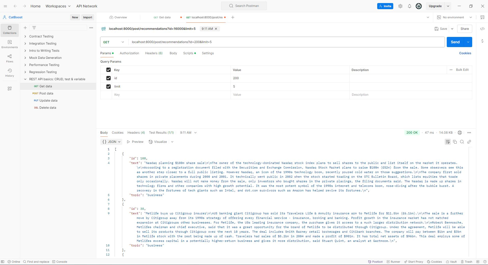
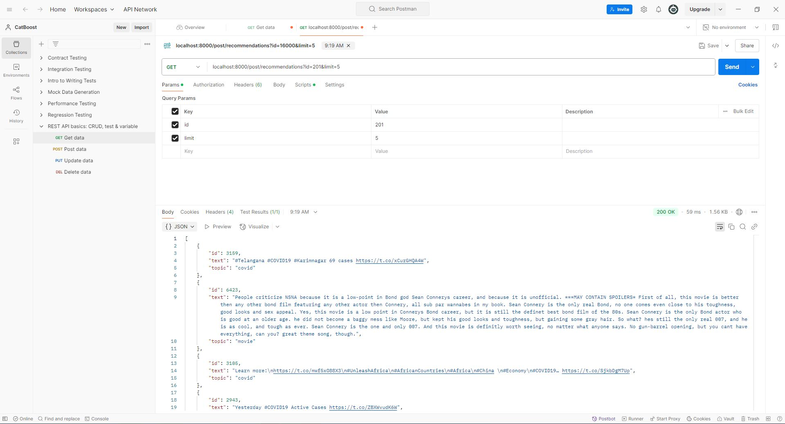
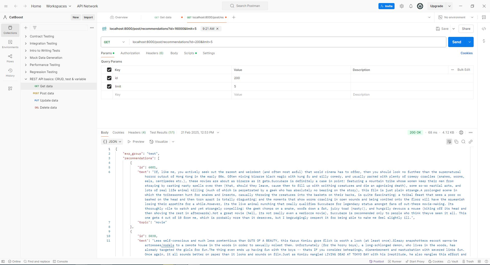
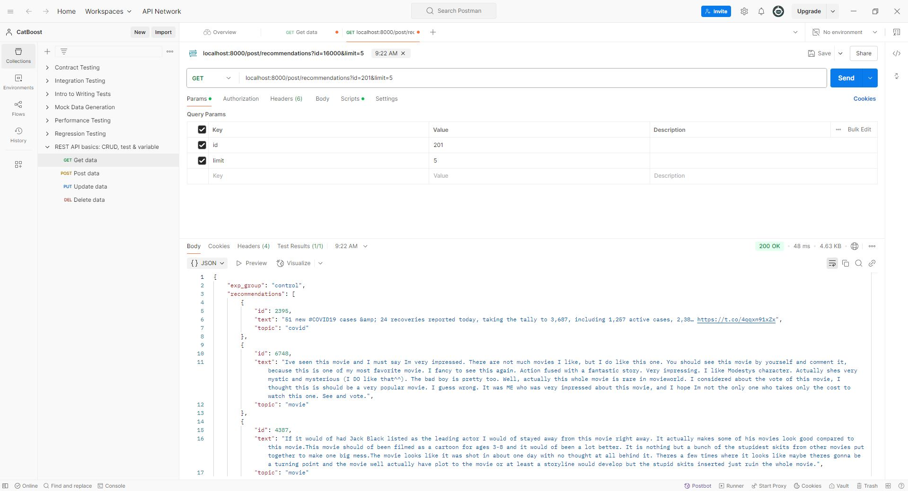

## 📌 Рекомендательная система постов социальной сети

### Цель проекта

Разработка рекомендательной системы, которая предлагает пользователю социальной сети релевантные посты на основе:

- информации о пользователях,
- контента постов,
- истории активности пользователей.

---

### 🛠 Инструменты

- [FastAPI](https://fastapi.tiangolo.com/) — backend-фреймворк
- [CatBoost](https://catboost.ai/) — модель машинного обучения
- [Postman](https://www.postman.com/) — инструмент для тестирования API
- [Uvicorn](https://www.uvicorn.org/) — сервер ASGI для запуска FastAPI

---

### 🚀 Быстрый старт

### 1. Клонирование репозитория

Скачайте репозиторий в локальную директорию:

```bash
git clone https://github.com/i-koskin/Recommendation-Service-CatBoost.git
cd Recommendation-Service-CatBoost
```

### 2. Загрузка предобученных моделей

Скачайте следующие модели и поместите их в корневую папку проекта ( ./Recommendation-Service-CatBoost):

- [catboost_model_PCA](https://drive.google.com/file/d/1gksqZ9tETozRNqnV_uvKhXqSciJAXwU7/view?usp=sharing)
- [catboost_model_W2V](https://drive.google.com/file/d/1ldkckMPxD7WVJjloa97nRhXmHU8u9L_f/view?usp=sharing)

### 3. Установка зависимостей

Установите сервер для запуска API:

```bash
pip install uvicorn
```

### 4. Запуск приложения

Используйте `uvicorn` для запуска FastAPI-приложения. В зависимости от модели используйте соответствующий файл:

```bash
# Для модели на основе PCA
uvicorn app_catboost_model_PCA:app --reload

# Для модели на основе Word2Vec
uvicorn app_catboost_model_W2V:app --reload

# Для эксперимента с двумя группами ('control' и 'test')
uvicorn app:app --reload
```

> ⚠️ `app` — это имя объекта FastAPI внутри соответствующего файла (например, `app_catboost_model_PCA.py`).

---

### 📬 Работа с API

Для отправки запросов к API рекомендуем использовать [Postman](https://www.postman.com/).

### Пример запроса

- Метод: `GET`
- URL:

```http
http://localhost:8000/post/recommendations?id=200&limit=5
```

**Параметры:**

- `id` — идентификатор пользователя (`user_id`)
- `limit` — количество постов, выводимых в ленте рекомендаций

### Ответ

#### Примеры ответов:

 

*Если используется файл `app.py`, в ответ также включается поле `exp_group`, указывающее на принадлежность пользователя к группе A/B теста:*

 

---
